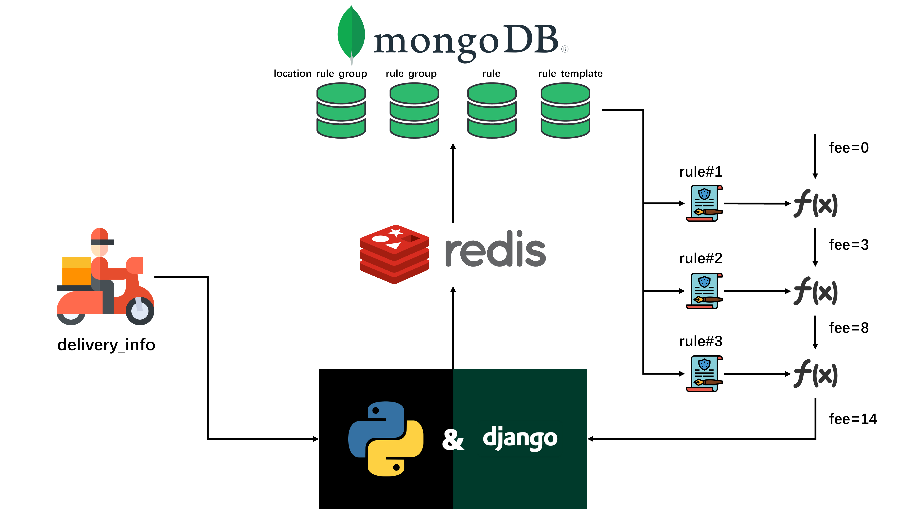

# Delivery Fee Calculator Backend Demo

This is the pre-assignment for [Wolt Summer 2023 Engineering Internships](https://github.com/woltapp/engineering-summer-intern-2023). The task is to write a delivery fee calculator. This code is needed when a customer is ready with their shopping cart and we’d like to show them how much the delivery will cost. The delivery price depends on the cart value, the number of items in the cart, the time of the order, and the delivery distance.

Although I've decided to do the backend part, I still made a simple frontend demo to better illustrate my ideas. Please [try out the deployed delivery fee calculator here](http://delivery-fee-calculator-frontend.s3-website-eu-west-1.amazonaws.com/)! 

You can easily calculate the delivery fee based on the rules defined in the task. One improvement I've made is that you can change the parameters in rules and even define your own rules so that we don't have to frequently rework on the backend code to meet new requirements in such ever-changing software market.

# Getting Started

The backend is build with Django, MongoDB, and Redis. Here are some instructions for launching the application. Whichever way you select, you need to download the code first.

## Launching by Docker

This is the recommended way if you just want to test the application on your own PC without dipping into it. 

First, you need to install Docker and Docker Compose. Here are the instructions for how to install latest [Docker](https://docs.docker.com/get-docker/) and [Docker Compose](https://docs.docker.com/compose/install/) on different platforms.

Now it's time to launch the application. At the root of the project, run the following command:
```bash
docker compose up
```
The above command will launch a MongoDB container, a Redis container, and at last our delivery fee calculator web application container. This may take some time if it's your first time to build it.

The init application does not have any rules for calculating delivery fees. Fortunately, I have some pre-defined rules which are exactly the same as the ones in the task in `data` folder. Now it's time to import the rules into MongoDB container volume for persistent storage using a python script.

You need to have Python installed on your PC (recommended version: 3.11) and install a package for connecting MongoDB:
```bash
pip install pymongo==4.3.3
```

After everything is done, change the directory into `data` and run the script:
```bash
cd data
python data_import.py
```
Remember that you should keep the containers running when you are importing rules.

If nothing weird happens, you've already launched the project successfully! Let's test the calculator by sending a HTTP GET request:
```bash
curl -XGET 'http://localhost:8100/api/calculation/calculate/?location=Helsinki&cart_value=4200&delivery_distance=4500&number_of_items=8&time=2023-01-20T18:00:00Z'
```
If you get the following response:
```json
{
  "data": {
    "delivery_fee": 1320,
    "charge_info": [
      {
        "rule_template_name": "Mininum cart value surcharge",
        "charge": 0
      },
      {
        "rule_template_name": "Differential pricing by delivery distance",
        "charge": 900
      },
      {
        "rule_template_name": "Number of items surcharge",
        "charge": 200
      },
      {
        "rule_template_name": "Extra fee during rush hour",
        "charge": 220
      },
      {
        "rule_template_name": "Maximum delivery fee constraint",
        "charge": 0
      },
      {
        "rule_template_name": "Free delivery fee condition",
        "charge": 0
      }
    ]
  },
  "status_code": 0
}
```
Then congratulations! You have successfully launch the application. Feel free to change the parameters in the GET request except for the location param.


## Setting up your own dev environment

This is the recommended way if you are interested in the project and want to see how it actually works in detail.

First, you need to have Python installed on your PC (recommended version: 3.11) and install all required packages:
```bash
pip install -r requirements.txt
```

Then, install the latest MongoDB. Follow the [guides](https://www.mongodb.com/docs/manual/installation/) here. You can also install MongoDBCompass if you need a database GUI. Next, install the latest Redis. Follow the [guides](https://redis.io/docs/getting-started/) here. Remember to start the database services after installation.

At last, run the command below:
```bash
python manage.py runserver 0.0.0.0:8100
```
This command will launch the application. The init application does not have any rules for calculating delivery fees. Fortunately, I have some pre-defined rules which are exactly the same as the ones in the task in `data` folder. You can import the data into MongoDB just as the previous section introduces. But you can also open the MongoDBCompass, create a database called "delivery_fee_calculator", create four collections inside called: "rule_template", "rule", "rule_group", "location_rule_group", and manually import the json data into corresponding collections.

If nothing weird happens, you've already launched the project successfully! Let's test the calculator by sending a HTTP GET request:
```bash
curl -XGET 'http://localhost:8100/api/calculation/calculate/?location=Helsinki&cart_value=4200&delivery_distance=4500&number_of_items=8&time=2023-01-20T18:00:00Z'
```
If you get the following response:
```json
{
  "data": {
    "delivery_fee": 1320,
    "charge_info": [
      {
        "rule_template_name": "Mininum cart value surcharge",
        "charge": 0
      },
      {
        "rule_template_name": "Differential pricing by delivery distance",
        "charge": 900
      },
      {
        "rule_template_name": "Number of items surcharge",
        "charge": 200
      },
      {
        "rule_template_name": "Extra fee during rush hour",
        "charge": 220
      },
      {
        "rule_template_name": "Maximum delivery fee constraint",
        "charge": 0
      },
      {
        "rule_template_name": "Free delivery fee condition",
        "charge": 0
      }
    ]
  },
  "status_code": 0
}
```
Then congratulations! You have successfully launch the application. Feel free to change the parameters in the GET request except for the location param.


# Core Ideas

Based on the task description, the most straightforward way to implement the backend is to write a calculation function with proper conditional logics defined by the given rules. That seems reasonable. However, after careful consideration, I think that's far from enough. From my perspective, we should do the task just as if we're in the real production environment. 

Here are some potential problems for the calculation scenario based on my personal experience:
1. The parameters in each rule, such as the minimum cart value and the maximum delivery fee, can change.
2. The rule itself can change. For example, the rule for delivery distance could be more complicated.
3. The number of rules in effect can change. For example, there could be more rules during festivals.
4. Since Wolt has buisness across different countries, different locations may have different rules.

We are definitely NOT supposed to change our backend code and redeploy them every time some parameters change or a new rule is added/removed. That's a really bad strategy in production environment. Instead, we should find a way to make our backend adjustable to the changing environment.

I'm being thinking that if there exists a better way to solve all the problems above. I get the inspiration from AWS IAM policy. In AWS Identification and Authorization Management, a user belongs to multiple groups. Each group is attached with multiple IAM policies which define relevant authorization. Whenever a user requests resources, AWS first finds which group the user is in and then find all the policies of that group. For each policy, AWS will check if there's a match for the requested resources.

Similar to AWS IAM policy, I assume that every customer belongs to a rule group. For simplicity, I assume that the rule group is determined by customer's location. In production, there might be more complicated logics to decide which rule group the customer is in. For each rule group, we can add multiple rules for calculating delivery fees. Each rule will trigger a function to do the calculation logic and output a partial charge (could be negative). The sum of all the partial charge is the total delivery fee.

Till now, part of Problem 3 and Problem 4 are resolved by adding/removing rules to/from rule group and attaching rule group to different locations. For Problem 1, there might be a scenario that the logic for calculation is the same but the parameters are different. How could we avoid defining redundant rules? Inspired by my previous internship at Tencent where we used different data annotation templates for different data annotation tasks, I define a rule template for the calculation logic and instantiate different rules with different parameters from the same template. Now, Problem 1 is also resolved.

Problem 2 and part of Problem 3 still remain unsolved. It seems that if we want to change or add rules, we have to change our backend code and redeploy them. Fortunately, we can utilize cloud technology to solve the problem. The delivery fee calculator is a good use case of serverless functions, like AWS Lambda Function. Deploying the calculator to a VM would be uneconomical because few people will order food after midnight. You pay only for the compute time you use instead of provisioning infrastructure upfront for peak capacity. Each cloud function servers as a calculation unit for a rule template. We can easily add, remove or change cloud functions without affecting the running backend. However, I don't use cloud functions in this project for saving my money :)

All in all, the main idea for the delivery fee calculator is:
1. Find the rule group by the location.
2. Find all the rules in that rule group.
3. Use the calculation functions defined by each rule to accumulate the delivery fee.
4. Output the total fee and all the partial charges.


# Architecture
## High Level View of Backend



Based on the high level view of the backend, let's walk through how the delivery fee is calculated.
1. Client sends a request to calculate the delivery fee. The request params contain the location, cart value, delivery distance, number of items, and time.
2. Django accesses MongoDB to find the rule group of the location.
3. Django accesses MongoDB to find the rules of that rule group.
4. Django accesses MongoDB to find the calculation function associated with each rule.
5. In step 2-4, all the data will be cached in Redis for better performance.
6. Following the priority of each rule, accumulate the delivery fee by executing each calculation function which produces a partial charge.
7. Return the final delivery fee and all partial charges.

## Developer Tools


The backend is developed on local PC and then pushed to GitHub repository. The push operation will trigger a GitHub Action pipeline. In the pipeline, the code is tested then deployed to AWS EC2.

# Testing
 
 I wrote a unit test for each calculation function and an integration test for delivery fee calculation. In the integration test, each input have several equivalence classes:
 1. cart value: [0,10), >=10
 2. delivery distance: [0, 1000], >1000
 3. number of items: [0,4], [5,12], >12
 4. time: whether in rush hour
Every time before deployment to EC2, all the tests must be passed to make sure that the code works correctly.